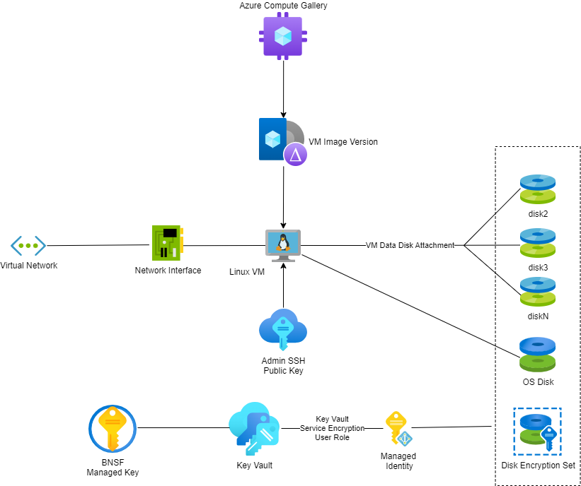

# Azure Linux Virtual Machine Terraform Module

## Purpose
This document will contain all the information that was gathered during the development of Virtual Machine module. This includes meetings, discussions, findings, strategic/tactical decisions taken. This document does not serve as a usage guide.
 
## Discussions and Outcomes
In our recent meeting, the team gathered the requirements from Jonathan wendt for a virtual Machine. Jonathan have also shared a sample repository.
According to resources mentioned in the [reference repository](https://github.bnsf.com/b037774/IaaS_VM_UPD_Examples), current Virtual Machine Module is built.
Jonathan, Peter and Platform Team have decided to implement a centralized Azure KeyVault strategy. Each environment will utilize its own dedicated KeyVault to store keys and secrets which are created as part of virtual machine module.
Each virtual machine will have a dedicated key created for disk encryption stored in the centralized KeyVault.
Also the team decided to create a network interface, a disk encryption set, and a os disk for the virtual machine.
The team also decided to create a guest configuration extension and an Azure Monitor extension for the virtual machine.
The team also decided to create a resource group which will contain all the resources for this module.
The team also decided to provide option to assign system-assigned and user-assigned identities to the VM.

## Decisions
1. Default Location is set to "southcentralus".
2. Default network configuration Resource Group is set to "NetworkRG".
3. Default VM configuration can be overridden by the module caller.
4. name_prefix parameter is optional for the user to pass.
5. VMs identities should be provisioned by default with the type defined as “SystemAssigned” with the option of having type defined as “SystemAssigned, UserAssigned”.
6. When type is defined as “SystemAssigned, UserAssigned” , the UAI ids need to provided as necessary.

## Requirements
1. Terraform 0.14.x or later.
2. AzureRM provider 2.46.x or later.
3. Pass the mandatory project , environment.
4. Os Image must be a generalized image.
 
## Assumptions
1. Users have basic knowledge of Terraform and Azure services.
2. Networking infrastructure and access management policies are in place and understood by the users of the module.
3. Users must have ssh key pair created to access the Linux virtual machine. 

## Pending Decisions
1. Pending discussion on optional creation of Azure managed disks for VMs.

## References 
[Usage Posture Design](Jonathan_VM_Usage_Posture_Template.xlsx)