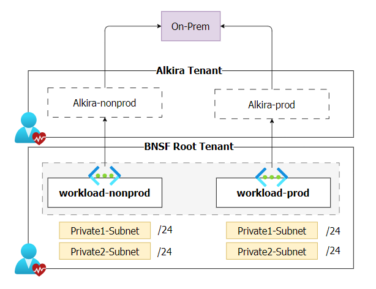

# Azure Virtual Network Terraform Module

## Purpose
This document will contain all the information that was gathered during the development of virtual network module. This includes meetings, discussions, findings, strategic/tactical decisions taken. This document does not serve as a usage guide.
 
## Discussions and Outcomes
In our recent meeting, the team reviewed the requirements from the landing zone design and discussed various aspects of vnet configuration, connectivity to onprem, and workloads. The outcomes led to specific decisions to start from workloads and take step by step decisions.

Also, had discussion on subnet cidr ranges and mostly the outcome was 10.x.x.x/28 but still an open question.
   
## Decisions
1. Default Location is set to "southcentralus".
2. Default Resource group name for any vnet in a subscribtion is set to "NetworkRG".
3. Vnet Module in the first cut would contain one vnet and two subnets named ["Private-1,Private-2"].
 
## Requirements
1. Resource Group named "NetworkRG" is required for a vnet to be deployed.
2. Terraform 0.14.x or later.
3. AzureRM provider 2.46.x or later.
 
## Assumptions
1. Users have basic knowledge of Terraform and Azure services.
2. Networking infrastructure and access management policies are in place and understood by the users of the module.
3. Seamless Integration and Connectivity between Landing Zone and CSP through Alkira

Disclaimer: This diagram is based on our understanding of how Alkira and Azure workload subscriptions will be paired however for detailed information, please reach out to the Network Engineering Team.

4. cidr range might be 10.x.x.x/28 but Richard might provide with 10.x.x.x/24 for demo purpose.

## Pending Decisions
1. Route Table Association is not finalized yet hence it is not implemented after discussion with Cory.
2. Network Security Groups is not finalized yet hence it is not implemented after discussion with Richard and Team.
3. cidr Range is not finalized yet but it is implemented using 10.x.x.x/24
4. How the network connectivity will flow to on-prem is not finalized yet. Process flows to be updated later on.

## References 
N.A